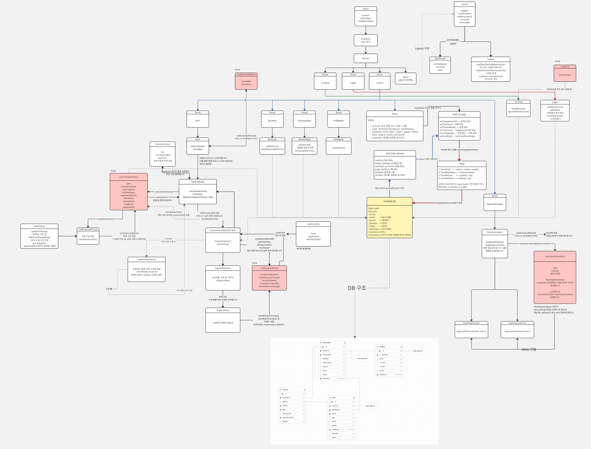
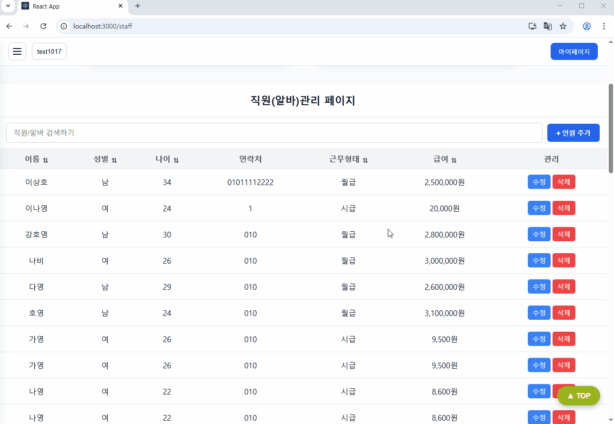
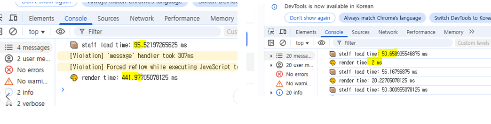
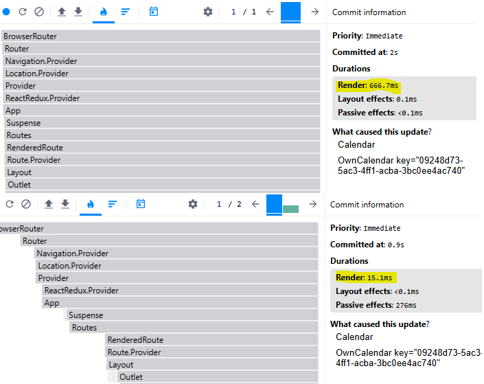
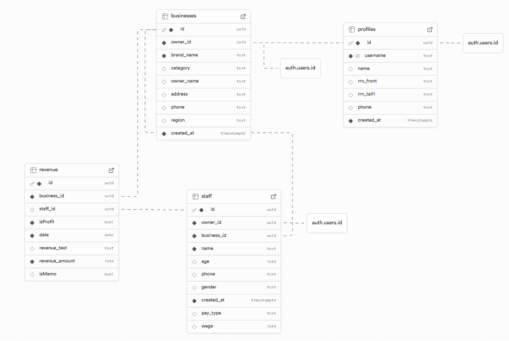

# UI

# Flow Chart

# 기획의도

## 기획 배경

- 현재 많은 개인 자영업자들은 일일 매출 및 지출 내역을 수기로 기록하거나 엑셀에 수동 입력하고 있습니다.
- 시간 소모가 크고, 데이터 누락 위험이 있는 방식을 개선하기 위해 간단하면서도 직관적인 <strong>'웹 기반 매출 관리 서비스’</strong >를 기획했습니다.

## 기대 효과

- 복잡한 회계 지식 없이도 달력만 클릭하면 매출/지출을 바로 기록하고 요약할 수 있도록 설계했습니다.
- 더 나아가 순이익 자동계산 및 월별 지출 합산 시각화로 자영업자들의 편의성 증대도 가능합니다.

# 주요 페이지

- **메인 페이지**: 기간별 수익 조회 / 달력 클릭을 통한 매출 입력 가능
- **분석 페이지**: 항목/일자 별 지출 시각화 제공
- **로그인/회원가입**: 사용자 인증
- **마이페이지**: 개인 정보 관리, 등록 업체 관리
- **업체 등록 페이지**: 업체 등록 및 관리
- **직원 관리 페이지**: 직원 등록, 검색, 정렬 및 관리 기능 지원

# 주요 기능

## CRUD

- Staff 페이지에서 직원의 정보를 조회, 삽입, 수정, 삭제 기능 지원

## SPA(router)

- 필요한 데이터만 갱신해 더 나은 UX 제공을 위한 SPA 사용
- SPA 구성 (Main | business | staff | profile | analysis)

## 가상 스크롤

- 보이는 영역의 데이터만 렌더링해 성능을 높임(Staff 페이지)
- 작동화면
  
- 최적화 내용 (Render time: 441ms -> 2ms)
  

## 코드스플리팅

- React의 lazy()와 Suspense를 활용해 페이지 로딩속도 최적화
- 최적화 내용 (Render time: 666ms -> 15ms)
  

## 외부데이터 연동

- Supabase API를 사용해 데이터베이스와 로그인 인증 기능을 구현
- Supabase DB 구조
  

## 반응형웹

반응형 UI로 구성되어 있어 PC/모바일 모두 대응 가능

# 팀원 및 역할 분담

|                                        한정연(팀장)                                        |                                           강진수                                           |                                           조준환                                           |
| :----------------------------------------------------------------------------------------: | :----------------------------------------------------------------------------------------: | :----------------------------------------------------------------------------------------: |
|  |  |  |
|             Main, chart 페이지 제작. Calendar, Modal, Layout components 제작.              |              Staff 페이지 제작. 가상 스크롤 적용. 전체 아이디어 및 정보 검수.              |                 Login, Landing, Business 페이지 제작. Supabase 테이블 관리                 |
|                            [GitHub](https://github.com/DOT-SOY)                            |                          [GitHub](https://github.com/shanekang1)                           |                          [GitHub](https://github.com/junhwan0427)                          |
