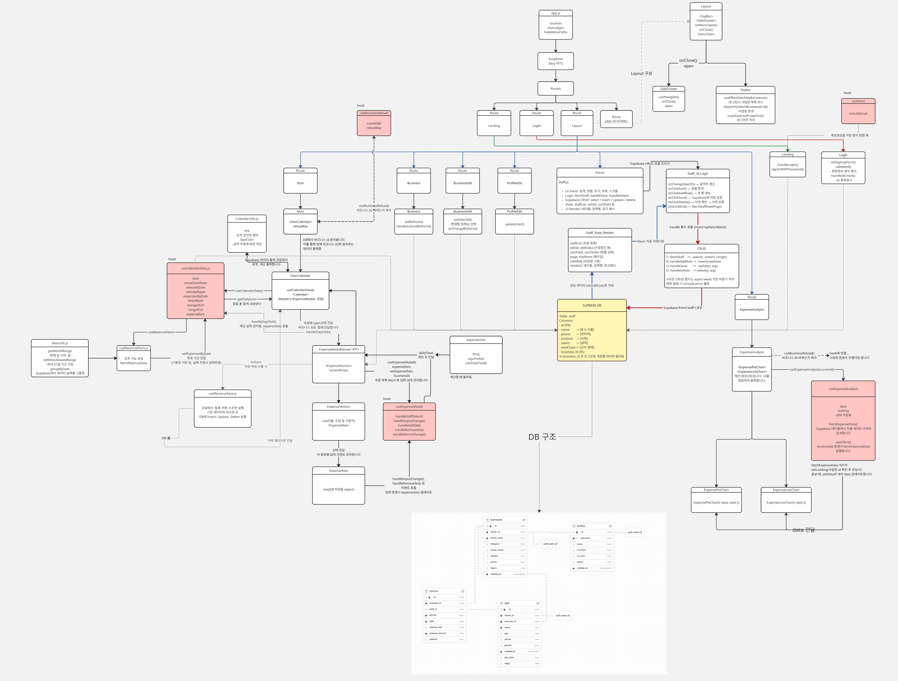

# UI

<<<<<<< HEAD
# Flow Chart

# 기획의도

=======
>>>>>>> 79580f03148fd5b73f989f6b11e0fe9480fa5696
## 기획 배경

- 현재 많은 개인 자영업자들은 일일 매출 및 지출 내역을 수기로 기록하거나 엑셀에 수동 입력하고 있습니다.
- 시간 소모가 크고, 데이터 누락 위험이 있는 방식을 개선하기 위해 간단하면서도 직관적인 <strong>'웹 기반 매출 관리 서비스’</strong >를 기획했습니다.

## 기대 효과

- 복잡한 회계 지식 없이도, 달력만 클릭하면 매출/지출을 바로 기록하고 요약할 수 있도록 설계했습니다.
- 더 나아가 순이익 자동계산 및 월별 지출 합산 시각화로 자영업자들의 편의성 증대도 가능합니다.

<<<<<<< HEAD
# 주요 페이지
=======
## 프로젝트 개요

- 이 플랫폼은 React 프론트엔드, 오픈소스 웹 백엔드 플랫폼 Supabase를 결합하여 자영업자들이 손쉽게 매출관리 / 직원관리 / 월 지출 분석 등 가계부 작성을 보다 쉽게 관리할 수 있도록 지원합니다.
- 이 프로젝트는 자영업자들이 가게 매출 및 직원 관리를 효율적으로 관리할 수 있는 웹 애플리케이션입니다.

# 2. 주요 페이지
>>>>>>> 79580f03148fd5b73f989f6b11e0fe9480fa5696

- **메인 페이지**: 기간별 수익 조회 / 달력 클릭을 통한 매출 입력 가능
- **분석 페이지**: 항목/일자 별 지출 시각화 제공
- **로그인/회원가입**: 사용자 인증
- **마이페이지**: 개인 정보 관리, 등록 업체 관리
- **업체 등록 페이지**: 업체 등록 및 관리
- **직원 관리 페이지**: 직원 등록, 검색, 정렬 및 관리 기능 지원

# 주요 기능

<<<<<<< HEAD
## CRUD

## SPA(router)

## 가상 스크롤

## 코드스플리팅

## 외부데이터 연동

## 반응형웹
=======
## 메인 페이지

- SPA구조로 설계해 데이터 최적화
- 달력

## 직원 관리 페이지

- 직원 등록/수정/삭제 기능
- 직원 검색/정렬 기능
- 무한 스크롤 최적화

## 사용자 관리

- **회원가입/로그인**: 일반 로그인
- **마이페이지**: 개인 정보 관리, 등록 업체 관리
>>>>>>> 79580f03148fd5b73f989f6b11e0fe9480fa5696

# 4. 각자 맡은 역할

## 한정연(팀장)

- 메인페이지
- 분석 페이지
- 코드 통합

## 강진수

- 직원 관리 페이지

## 조준환

- 회원가입 화면, 업체 등록 화면

# 4. flow + UI(gif 파일이면 더 좋음)

- CRUD:생성/조회/수정/삭제 전부 구현
- SPA(router)
- 가상 스크롤: 데이터의 효율화 처리
- 코드스플리팅: lazy+ Suspense 처리하기
- 외부데이터 연동: 외부데이터 이름
- 반응형웹(PC, 태블릿 or 모바일)
