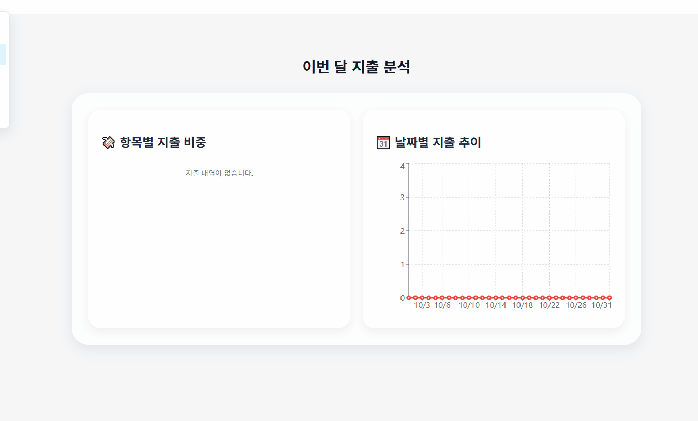
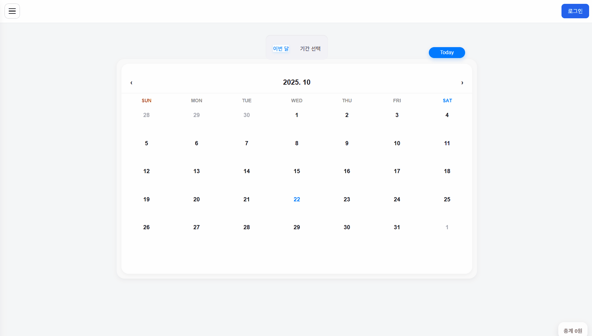
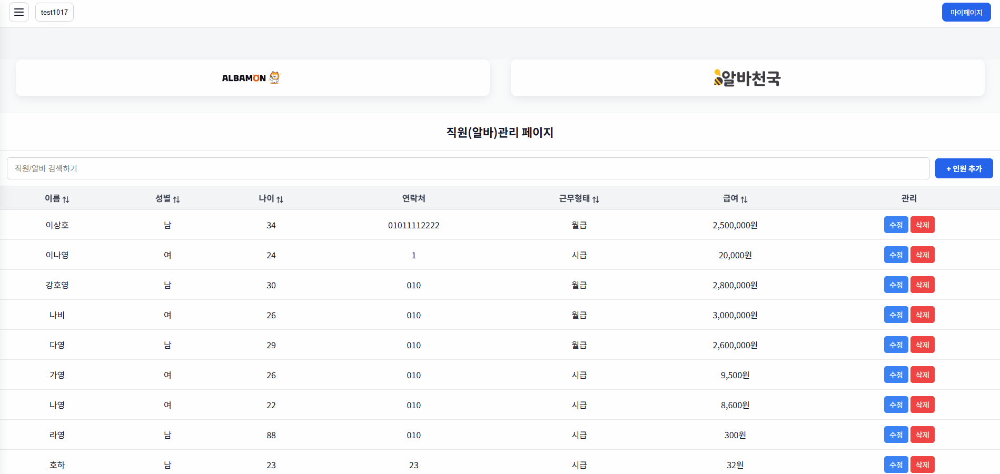
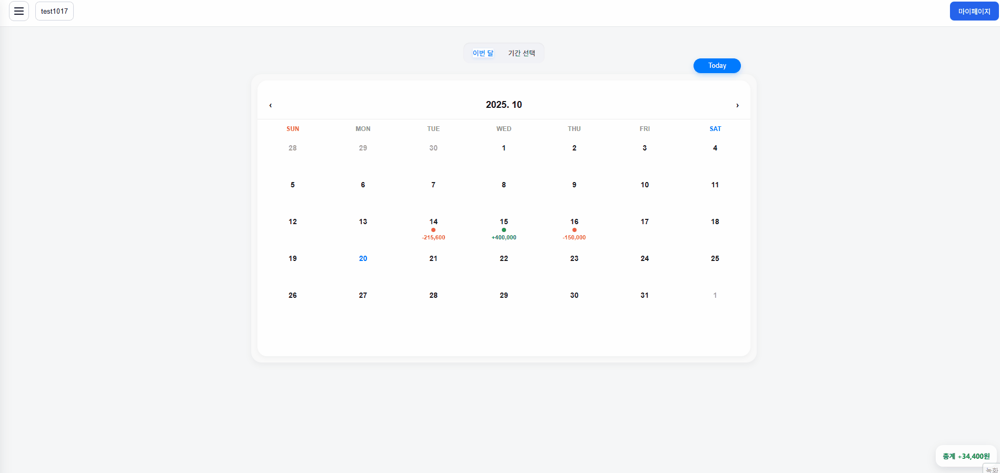

# 소상공인을 위한 달력 가계부 웹 애플리케이션

# 기획의도

- 현재 많은 개인 자영업자들은 일일 매출 및 지출 내역을 수기로 기록하거나 엑셀에 수동 입력하고 있습니다.
- 시간 소모가 크고, 데이터 누락 위험이 있는 방식을 개선하기 위해 간단하면서도 직관적인 <strong>'웹 기반 매출 관리 서비스’</strong >를 기획했습니다.

## 기대 효과

- **간단한 매출/지출 기록 가능**

  복잡한 회계 지식 없이도 달력만 클릭하면 매출/지출을 바로 기록하고 요약할 수 있도록 설계했습니다.

- **편리한 직원 관리 서비스 제공**

  사용자가 쉽게 직원을 등록 및 삭제가 가능하고, 등록된 직원을 검색 및 정렬해주는 기능을 제공합니다.

- **월별 지출 내역 시각화**

  월별로 어떤 항목에 지출을 많이 했는지 시각화해주는 편의 서비스를 제공합니다.

## **참고 사이트 및 차별점**

- 참고 사이트: [그랜터](https://granter.biz/ai-automation)
- 차별점: 익숙한 달력 형식에 가계부를 더해 회계 지식이 없는 사용자들도 직관적인 사용이 가능합니다.

---

# 팀원 및 역할 분담

|                                        한정연(팀장)                                        |                                           강진수                                           |                                           조준환                                           |
| :----------------------------------------------------------------------------------------: | :----------------------------------------------------------------------------------------: | :----------------------------------------------------------------------------------------: |
|  |  |  |
|             Main, chart 페이지 제작. Calendar, Modal, Layout components 제작.              |              Staff 페이지 제작. 가상 스크롤 적용. 전체 아이디어 및 정보 검수.              |                 Login, Landing, Business 페이지 제작. Supabase 테이블 관리                 |
|                            [GitHub](https://github.com/DOT-SOY)                            |                          [GitHub](https://github.com/shanekang1)                           |                          [GitHub](https://github.com/junhwan0427)                          |

# 주요 구현 기능

## CRUD

- 매출 및 직원정보 등록, 조회, 삽입, 수정, 삭제 기능을 지원합니다.

## SPA(router)

- 필요한 데이터만 갱신해 더 나은 UX 제공을 위해 SPA환경을 구축했습니다.
- SPA 구성 (Main | business | staff | profile | analysis)

## 가상 스크롤

- 보이는 영역의 데이터만 렌더링해 성능을 높였습니다.
- 작동화면
  
- 최적화 내용 (Render time: 441ms -> 2ms)
  

## 코드스플리팅

- React의 lazy()와 Suspense를 활용해 페이지 로딩속도 최적화
- 최적화 내용 (Render time: 666ms -> 15ms)
  

## 외부데이터 연동

- Supabase API를 사용해 데이터베이스와 로그인 인증 기능을 구현
- Supabase DB 구조
  

## 반응형웹

- 반응형 UI로 구성되어 있어 PC/모바일 모두 대응 가능합니다.
  

# UI 및 상세 Flow 요약

## **메인 페이지**

> flow 요약:

- 기간별 수익 조회
- 달력 클릭을 통한 매출 입력 가능

  

## **분석 페이지**

> flow 요약:

- 항목/일자 별 지출 시각화 제공

  

## **로그인/회원가입**: 사용자 인증

> flow 요약:

- 사용자 인증
- 형식에 맞는 데이터 저장

  

## **직원 관리 페이지**: 직원 등록, 검색, 정렬 및 관리 기능 지원

> flow 요약:

- 직원 등록, 검색, 정렬 및 관리 기능 지원

## **업체 관리 페이지**

> flow 요약:

- 업체 등록, 수정, 전환 가능
- 업체 전환 시 해당 업체 데이터로 변경

# Flow Chart

# 개발 환경

  
